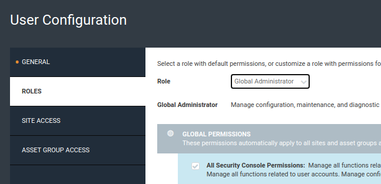

# Development

This integration focuses on
[Rapid7 InsightVM](https://www.rapid7.com/products/insightvm/) and is using
[Rapid7 InsightVM REST API](https://help.rapid7.com/insightvm/en-us/api/index.html)
for interacting with the InsightVM platform.

## Prerequisites

InsightVM is a self-hosted product and it has system requirements that are
listed [here](https://docs.rapid7.com/insightvm/requirements).

The setup process consists of
[downloading InsightVM](https://docs.rapid7.com/insightvm/download) (Windows and
Linux both supported),
[installation process](https://docs.rapid7.com/insightvm/install) and then
[accessing the security console](https://docs.rapid7.com/insightvm/log-in-and-activate).

### Alternative: Docker Setup

As an alternative to installing InsightVM on your local machine, you can use the
Docker setup described in [console/README.md](../console/README.md)

## Provider account setup

To install a Rapid7 InsightVM account, please use the links from above. During
the installation you'll be asked for admin account username and password that
you'll later use to access the Security Console.

To set up a Rapid7 InsightVM account, please follow these steps:

1. Visit the [Rapid7 Try](https://www.rapid7.com/trial/insightvm/) page - it is
   a 2 page/step form where you're first asked details about you and your
   organization and on the form you're able to select InsightVM as the product
   you want to sign up for.
2. Make sure to select InsightVM on the second form page, it might be
   preselected by default, if not just select it manually.
3. After creating the account you should receive an email titled "Your InsightVM
   License Key - Get Started" which will contain your one-time-use License-Key.
   You'll need it for the next step.
4. Go to https://localhost:3780 (the default Security Console access uri), it
   might take some time before everything is initialized and you're able to see
   the login screen.
5. Log in to the console using the admin username and password you choose during
   the installation procedure.
6. After the first time login you'll be asked to do two things:

1) enter the license key from the email that you received
2) connect your account with the insight account using the console pairing key
   <- this step is described very well on
   [this page](https://www.rapid7.com/cx/get-started-with-insightvm-cloud-capabilities/2/).

7. The provider account is now fully set up.

## Authentication

In order to use InsightVM REST API the requests must supply authorization
credentials. This integration does it by including Authorization header using a
Base64 of the InsightVM console account's "username:password".

Note: The admin account that got created during the installation process can be
used for this, but you might want to create a separate user account instead. To
do this, you'll need to navigate to Security Console's
[Administration section](https://localhost:3780/admin/index.jsp). Once there,
you can [create](https://localhost:3780/admin/user/config.jsp) and
[manage](https://localhost:3780/admin/users.jsp) user accounts.

If you want to create a new user, use the
[create](https://localhost:3780/admin/user/config.jsp) and fill out the form.\
**Important note:** if the new user's role isn't "Global Administrator" this won't
work because that account doesn't have sufficient permissions for this integration
to do all of its requests.



Create a .env file at the root of this project, and set the variables to admin
credentials & host you've set up during the development. Also set
`DISABLE_TLS_VERIFICATION`, assuming your development environment uses the
default self-signed certificates provided by the Rapid7 Nexpose Security
Console.

```bash
INSIGHT_HOST=localhost:3780
INSIGHT_CLIENT_USERNAME="admin-username"
INSIGHT_CLIENT_PASSWORD="admin-password"

DISABLE_TLS_VERIFICATION=true
```

After following the above steps, you should now be able to start contributing to
this integration. The integration will pull in the `INSIGHT_CLIENT_USERNAME`,
`INSIGHT_CLIENT_PASSWORD`, `INSIGHT_HOST`, and `DISABLE_TLS_VERIFICATION`
variables from the `.env` file and use them when making requests.

## Test Data Setup

If you are using the docker setup described above and wish to get some data in
the console to test this integration you can do the following:

### Run scan against host machine:

Use `host.docker.internal` as the site you wish to scan. This will be resolved
by docker as your laptops internal IP. This will be ingested as an asset. If you
need vulnerability data, do the next option instead.

### Run a DVWA Docker Container

**DVWA** (Damn Vulnerable Web App) is a web application that has many known
vulnerabilities. This will ensure that the Rapid7 will return vulnerability
results after scanning.

1. Create docker network:

```
   docker network create vulnerable-net
```

2. Once Rapid7 container is running:

```
   docker network connect vulnerable-net rapid7-vm-console-container
```

3. Run DVWA and connect to network:

```
   docker run --rm -it -p 80:80 --network vulnerable-net vulnerables/web-dvwa
```

Go to the DVWA app at localhost. Follow the directions and make sure that
security is set to low. More info
[here](https://hub.docker.com/r/vulnerables/web-dvwa)

4. Get DVWA IP:

```
   docker network inspect vulnerable-web
```

This output will show the connected containers. Grab the IP of the DVWA
container and use this to be scanned in the Rapid7 console.
